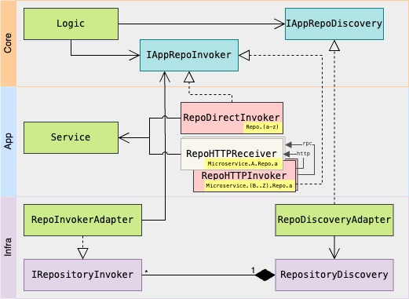

# A lib to discover repositories across microservices

## Installation

```
npm i --save https://github.com/tmukammel/lib-repo-discovery.git
```

## Usage

<p align="center"></p>

### Step 01: Implement own counter declaration of `IRepositoryInvoker` interface

```js
// In the application layer

// BaseRepoDirectInvoker.ts

export default class BaseRepoDirectInvoker implements IAppRepoInvoker {

    // ...

    // Likely implementation of IAppRepoInvoker interface
    /************************************************************************************************/

    async get<JSON, Model>(query: JSON, isCollection?: boolean): Model | Model[] {
        query = await queryParser.parse(query);
        return isCollection
            ? this.service.repository.getModelCollection(query)
            : query?.params?.hasOwnProperty('id')
            ? this.service.repository.getModelById(query?.params?.id, 'include' in query ? query.include : null)
            : this.service.repository.getModel(query);
    }

    async validate<JSON, Model>(query: JSON, validationLogic: (data: Model) => boolean): Promise<boolean> {
        const res = await this.service.repository.getModelById(
            query?.params?.id,
            'include' in query ? query.include : null
        );
        return validationLogic(res);
    }

    transact<JSON, Transaction, Model>(method: string, query: JSON, transaction: Transaction, data?: Model): Model {
        enum AllowedMethods {
            post = 'POST',
            put = 'PUT',
            patch = 'PATCH',
            delete = 'DELETE'
        }

        switch (method) {
            case AllowedMethods.post:
                return this.service.repository.createModel(query, transaction);
            case AllowedMethods.put:
            case AllowedMethods.patch:
                return this.service.repository.updateModel(data, query, transaction);
            case AllowedMethods.delete:
                return this.service.repository.deleteModel(query, transaction);
        }
    }
    /************************************************************************************************/
}
```

### Step 02: Add `IRepositoryInvoker` interface implementars to repo invoker registry

```js
// In the application bootstrap file

// App.ts

// Likely registration of BaseRepoDirectInvoker as IRepositoryInvoker

repoDiscovery: RepositoryDiscovery = RepositoryDiscovery.instance()

forEach((ModelName) => {
    db: BaseORM = new Sequelize()
    model: IModel = new UserModel(db)
    repo: IRepository = new BaseRepo(model)
    service: IService = new BaseService(repo)
    controller: IController = BaseController(service)
    // ... add to router

    // add BaseRepoDirectInvoker to RepositoryInvokerRegistry
    repoInvoker: IAppRepoInvoker = new BaseRepoDirectInvoker(service)
    repoInvokerAdapter: IRepositoryInvoker = new RepositoryInvokerAdapter(repoInvoker)
    repoDiscovery.addToRepositoryInvokerRegistry(repoInvokerAdapter)
})
```

### Step 03: Discover invoker and invoke repository through invoker

```js
// Likely code sample of ivoker discovery and invocation of repository

// some logic module...
repoDiscovery: IAppRepoDiscovery
func constructor(repoDiscoverer: IAppRepoDiscovery) {
    this.repoDiscovery = repoDiscoverer
}
repoInvoker: IAppRepoInvoker = this.repoDiscovery.getRepositoryInvoker("Users")
userData: UserModelStab = await repoInvoker.get({/*JSON query*/}, false)
```

## Specification

1. The lib should allow resource repository discovery across monolyth, packages and microservices
2. should be communication protocol agnostic (e.g: should support - HTTP, google RPC, socket, etc...)
3. client should use common interface for any communication protocol

## Background

lib-repo-discovery should enable a monolyth, monorepo packages, micro services to allow repository invocation across them without needing to import the specific repository. The lib-repo-discovery interfaces will specifically allow us to validate data, get data, run transactional updates on any repository across the system.

This lib should have three alternative working layers for communication

1. method call within monolyth probably with multiple packages
2. event driven communication between processes within same service (instance)
3. over the network communication between services in microservices environment
   1. over the network communication can have different protocols
      1. HTTP
      2. gRPC
      3. socket


Example,
> Suppose JobService & UserService are two microservices.
> 
> We need to fetch UserProfile including any JobApplications.
> 
> And that means, we need UserProfile from UserService and JobApplications from JobService.
> 
>  The client browser requested something like `api/user_profile/:id?include=JobApplications`. 
> 
> In UserProfileService we get the user data but JobService is in different microservice.
> 
> Now we use the lib-repository-discovery to get the jobApplicationsRepoInvoker and call `jobApplicationsRepoInvoker.get(query: {where: {user_id: id}}, isCollection?: true)`.

## Current bottlenecks

Currently this lib only work for packages running in the same node instance.

In cluster environemnt, each cluster will have a full set of service packages running in each node with it's own instance of lib-repo-discovery, and lib-repo-discovery will route discovery calls to service packages running only within the node instance. In the following versions we should also be able to serve over the network calls using different protocols.

## Lib design

### Class diagram [edit](https://mermaid.live/edit#pako:eNqdVF1vmzAU_SuWn5KJoFAIKW5GpS17iLRIW5enjmlyjUOsgs2MiUbT_PddPvKlsE5aJBSufe45595rs8NMxRwTzFJaFHNBE02zSMZCc2aEkmj1IZKRbHbRA89VIYzS1VwUTG25rtAukgh-uRZbajgqDDWC9SJ_Cgm7knEgNAf8kuazwmghEwstTlkLuVXPXIdI80TAfnWpwhRQ6ZIBdDCs_TWb5VMK0p2DhJtFpzcYkj5DF1kAv1IfPPOKoNYdUFzbQ6-olDFfC8njCzYaxyt1BX_oajnntaDCXHWAPg0QflIq5RSq3NelHobRY6ebxWwmpOF6TRkPw3YJypt9tdAyHPwqoXSCIBDFR5Wm7Zjvjyqgt4S6lt9_tJlbmooYel6nz8_Tuw1I_qwSwQgaQEQJmg_R-_CM7YtWmSj4rFsJ71peo6ksKGtsrRrqjJuNik-NOUkdsKBFanAtdF8rwXPXteVvTema3hh9o0H_MzFGAfr2zA7u-u6Dbb-G_zBMkMjylGdcmqKfJMJOhNG70ah-s20JQc_BIHBjsmYRSLGFM64zKmK49k1HImw2IBJhAq9wnmmZmgiDdYDS0qhvlWSYwIXjFtaqTDaYrGlaQFTm9dnoPhvH1ZzKR6WyQ0oL-hTXlo4Y3oTL7uNT_zV5mOzwb0xGru_a3sQLxm7g3jjT8Xhi4QoT59a33Ukw9saB43qB4033Fn5ptBx7Mgn8wPennuv5wY3r7_8AL-O0Yg)


